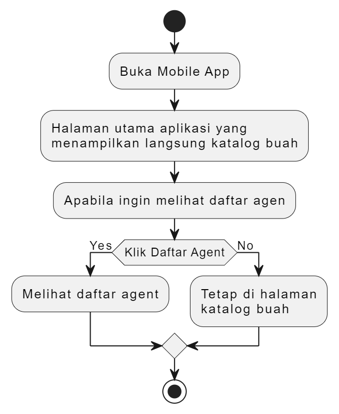

# **UTS PEMROGRAMAN MOBILE**
Nama : Ayumi Permana

NIM : 20220801127

Fakultas/Jurusan : Ilmu Komputer/Teknik Informatika

Mata Kuliah : Pemrograman Mobile 

Dosen Pengampu : JEFRY SUNUPURWA ASRI , S.Kom., M.Kom.

# **Mobile Apps E-Distribusi Agent**
### Bussines Domain : Fresh Fruit

### Bussines Process : Layanan Informasi E-Distribusi Agent Buah

## Introduction
E-Distribusi agen adalah distribusi berbasis elektronik yang menggunakan teknologi digital untuk memfasilitasi penyampaian informasi terkait produk dari distributor (agen) kepada pelanggan. Agen berperan sebagai perantara utama dalam rantai pasok yang bertugas menghubungkan produsen atau pemasok dengan konsumen akhir. Agen tidak hanya menjadi penghubung, tetapi juga bertanggung jawab memastikan ketersediaan produk, memberikan informasi yang akurat, dan menjaga kualitas layanan kepada pelanggan.

## Objective
Mobile Apps sebagai penunjang dalam kemudahan pelanggan melihat agen distribusi katalog buah yang terpercaya.

## Scope
- Layanan Informasi hanya mencakup katalog buah untuk ditribusi
- Layanan Informasi hanya mencakup agen yang sudah terdaftar dan terpercaya
- Riwayat transaksi hanya penambahan informasi transaksi untuk setiap agen

Kriteria sukses pada batasan tersebut :
Pelanggan memiliki akses ke internet dan perangkat mobile yang mendukung untuk melakukan melihat Layanan Informasi E-Distribusi Agent Buah.

# **Business Requirement Document**

# 1. Business Requirement Definition

## Jenis Layanan :

Layanan Informasi E-Distribusi Agent Buah

## Definisi :

Proses layanan informasi e-distribusi agen buah dirancang untuk mempermudah pelanggan dalam mengakses informasi terkait katalog buah yang tersedia untuk distribusi, serta daftar agen terpercaya yang siap memenuhi kebutuhan pelanggan. Layanan ini mencakup fitur seperti katalog produk yang lengkap, meliputi informasi harga, deskripsi, dan asal produk. Selain itu, pada daftar agen dilengkapi dengan riwayat transaksi dan informasi lokasi agen.

## Abstrak : 

Layanan e-distribusi agen buah dirancang untuk memberikan kemudahan bagi pelanggan dalam mengakses informasi katalog buah dan agen terpercaya secara efisien dan transparan. Layanan ini menyediakan katalog buah yang dilengkapi dengan informasi, seperti harga, deskripsi, asal, serta keunggulan produk, sehingga pelanggan dapat dengan mudah memilih buah sesuai dengan kebutuhan mereka. Selain itu, layanan ini juga menampilkan data agen, mencakup lokasi, profil, dan riwayat transaksi, untuk memastikan kepercayaan dan transparansi dalam bertransaksi. Layanan ini berfokus pada peningkatan efisiensi, transparansi, dan pengalaman pengguna yang optimal.

# 2. Penjelasan Fungsi
## Fungsi Teknis :

### I.	Katalog Buah

Katalog buah berfungsi sebagai pusat informasi bagi pelanggan untuk melihat daftar produk buah yang tersedia. Setiap buah ditampilkan dengan detail seperti nama, harga per satuan (kg atau unit), deskripsi singkat, asal (lokal atau impor), serta gambar yang relevan untuk mempermudah identifikasi visual.

### II.	Daftar Agen

Daftar agen berfungsi sebagai sumber informasi mengenai agen-agen terpercaya yang terlibat dalam distribusi buah. Setiap agen memiliki profil yang mencakup nama, lokasi, foto profil, dan riwayat transaksi. 

### III. Riwayat Transaksi

Riwayat transaksi berfungsi untuk menyajikan data transaksi yang telah dilakukan oleh agen. Riwayat ini melihatkan informasi mengenai transaksi jumlah belanja, total belanja, dan tanggal terakhir melakukan transaksi.

## Fungsi Strategis :
I.	Katalog buah memudahkan pelanggan untuk mengakses informasi lengkap tentang produk yang tersedia, termasuk nama, harga, deskripsi, asal, dan stok sebelum menuju ke agen. Dengan fitur pencarian dan penyaringan, pelanggan dapat menemukan produk yang sesuai dengan kebutuhan mereka secara cepat dan efisien.

II.	Layanan informasi menyediakan akses yang mudah bagi pelanggan untuk mendapatkan informasi daftar agen terpercaya dan riwayat transaksi agen tersebut.

# 3. Fungsional dan Spesifikasi Kebutuhan Bisnis

## I. E-Distribusi Agent Buah Flows

## II.	Spesifikasi Kebutuhan Bisnis

Layanan Informasi E-Distribusi Agen Buah bertujuan untuk menyediakan platform berbasis aplikasi mobile yang mempermudah pelanggan dalam mengakses informasi katalog produk buah, daftar agen terpercaya, dan riwayat transaksi agen. Informasi ini dirancang untuk meningkatkan kepercayaan pelanggan terhadap agen. Melalui fitur-fitur utama, seperti katalog buah, daftar agen, dan riwayat transaksi, layanan ini menawarkan solusi bagi pelanggan untuk mendapatkan produk dan agen berkualitas dengan mudah.

## II.	Fungsional dan Proses

### Fungsional : 

Menampilkan katalog produk dan daftar agen yang terpercaya berupa riwayat transaksinya

### Proses :

Pengguna melihat katalog buah dan dapat mengaskes daftar agen yang sudah menampilkan transaksi secara kronologis, mencakup informasi produk, jumlah, dan total harga.

